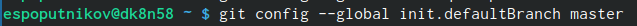

---
## Front matter
title: "Отчёт по лабораторной работе №2"
subtitle: "Система контроля
версий Git"
author: "Попутников Егор Сергеевич"

## Generic otions
lang: ru-RU
toc-title: "Содержание"

## Bibliography
bibliography: bib/cite.bib
csl: pandoc/csl/gost-r-7-0-5-2008-numeric.csl

## Pdf output format
toc: true # Table of contents
toc-depth: 2
lof: true # List of figures
lot: true # List of tables
fontsize: 12pt
linestretch: 1.5
papersize: a4
documentclass: scrreprt
## I18n polyglossia
polyglossia-lang:
  name: russian
  options:
	- spelling=modern
	- babelshorthands=true
polyglossia-otherlangs:
  name: english
## I18n babel
babel-lang: russian
babel-otherlangs: english
## Fonts
mainfont: PT Serif
romanfont: PT Serif
sansfont: PT Sans
monofont: PT Mono
mainfontoptions: Ligatures=TeX
romanfontoptions: Ligatures=TeX
sansfontoptions: Ligatures=TeX,Scale=MatchLowercase
monofontoptions: Scale=MatchLowercase,Scale=0.9
## Biblatex
biblatex: true
biblio-style: "gost-numeric"
biblatexoptions:
  - parentracker=true
  - backend=biber
  - hyperref=auto
  - language=auto
  - autolang=other*
  - citestyle=gost-numeric
## Pandoc-crossref LaTeX customization
figureTitle: "Рис."
tableTitle: "Таблица"
listingTitle: "Листинг"
lofTitle: "Список иллюстраций"
lotTitle: "Список таблиц"
lolTitle: "Листинги"
## Misc options
indent: true
header-includes:
  - \usepackage{indentfirst}
  - \usepackage{float} # keep figures where there are in the text
  - \floatplacement{figure}{H} # keep figures where there are in the text
---
github
# Цель работы

Целью работы является изучить идеологию и применение средств контроля версий. При-
обрести практические навыки по работе с системой git.

# Задание

1. Создайте отчет по выполнению лабораторной работы в соответствующем каталоге
рабочего пространства (labs>lab02>report).
2. Скопируйте отчеты по выполнению предыдущих лабораторных работ в соответствую-
щие каталоги созданного рабочего пространства.
3. Загрузите файлы на github.

# Выполнение лабораторной работы
2.1. Настройка github.
Для начала сделаем предварительную настройку git. Откроем
терминал и введём следующие команды(рис. @fig:001)(рис. @fig:002):

{#flig:001 width=70%}

{#flig:002 width=70%}

Настроим utf-8 в выводе сообщений git(рис. @fig:003):

{#flig:003 width=70%}

Зададим имя начальной ветке, назовём её master(рис. @fig:004):

{#flig:004 width=70%}

Настроим параметры autocrlf и safecrlf(рис. @fig:005)(рис. @fig:006):

{#flig:005 width=70%}

{#flig:006 width=70%}

2.2. Создание SSH ключа.
Далее необходимо сгенерировать пару ключей (приватный и
открытый)(рис. @fig:007):

{#flig:007 width=70%}

Затем копируем из консоли ключ и создаём ключ с именем Title
на сайте github.org.(рис. @fig:008)

{#flig:008 width=70%}

2.3. Создание рабочего пространства и репозитория на
основе шаблона.
На рис.6 можно увидеть как мы создали каталог “Архитектура
компьютера”.(рис. @fig:008)

2.4. Создание репозитория курса на основе шаблона.
Переходим на страницу репозитория с шаблоном курса, далее
выбираем Use this template. В открывшемся окне задаем имя
репозитория, а затем создаем его. Переходим в каталог курса и клонируем созданный репозиторий(рис. @fig:009):

{#flig:009 width=70%}

2.4. Настройка каталога курса.
Переходим в каталог курса и удаляем лишние файлы(рис. @fig:010):

{#flig:010 width=70%}

Затем создадим необходимые каталоги (echo arch-pc >
COURSE, make, рис.8)(рис. @fig:010)
Отправим файлы на сервер(рис.9-10)(рис. @fig:011)(рис. @fig:012):

{#flig:011 width=70%}

{#flig:012 width=70%}

3. Выполнение самостоятельной работы.
Создадим файл отчёта через программу LibreOffice Writer(рис. @fig:013):

{#flig:013 width=70%}

Открыв программу, переходим в вкладку файл и нажимаем
сохранить как(рис. @fig:014):

{#flig:014 width=70%}

Далее меняем формат файла на docx и сохраняем(рис. @fig:015):

{#flig:015 width=70%}

После этого перенесём созданный файл в каталог курса, а
лабораторную работу №1 скопируем(рис. @fig:016):

{#flig:016 width=70%}

Загрузим файлы на github(рис. @fig:017):

{#flig:017 width=70%}

# Выводы

В ходе выполнения самостоятельной и лабораторной работ, я
приобрёл практические навыки по работе с системой git, а
также изучил идеологию и применение средств контроля
версий.

