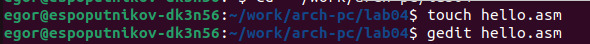
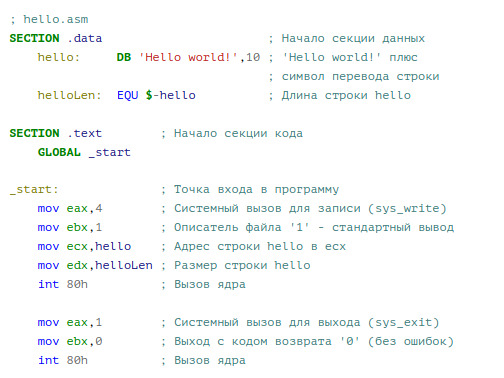
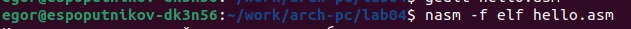
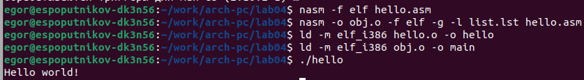
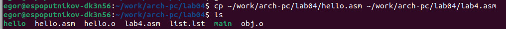
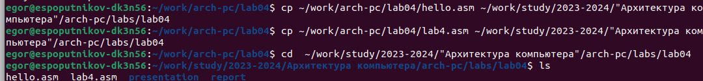
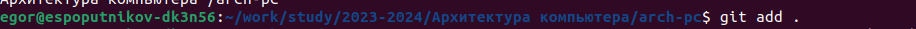
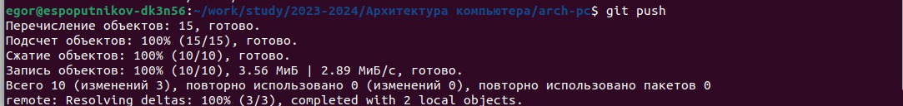

---
## Front matter
title: "Отчёт по лабораторной работе №4"
subtitle: "Создание и процесс обработки на языке ассемблера NASM"
author: "Попутников Егор Сергеевич"

## Generic otions
lang: ru-RU
toc-title: "Содержание"

## Bibliography
bibliography: bib/cite.bib
csl: pandoc/csl/gost-r-7-0-5-2008-numeric.csl

## Pdf output format
toc: true # Table of contents
toc-depth: 2
lof: true # List of figures
lot: true # List of tables
fontsize: 12pt
linestretch: 1.5
papersize: a4
documentclass: scrreprt
## I18n polyglossia
polyglossia-lang:
  name: russian
  options:
	- spelling=modern
	- babelshorthands=true
polyglossia-otherlangs:
  name: english
## I18n babel
babel-lang: russian
babel-otherlangs: english
## Fonts
mainfont: PT Serif
romanfont: PT Serif
sansfont: PT Sans
monofont: PT Mono
mainfontoptions: Ligatures=TeX
romanfontoptions: Ligatures=TeX
sansfontoptions: Ligatures=TeX,Scale=MatchLowercase
monofontoptions: Scale=MatchLowercase,Scale=0.9
## Biblatex
biblatex: true
biblio-style: "gost-numeric"
biblatexoptions:
  - parentracker=true
  - backend=biber
  - hyperref=auto
  - language=auto
  - autolang=other*
  - citestyle=gost-numeric
## Pandoc-crossref LaTeX customization
figureTitle: "Рис."
tableTitle: "Таблица"
listingTitle: "Листинг"
lofTitle: "Список иллюстраций"
lotTitle: "Список таблиц"
lolTitle: "Листинги"
## Misc options
indent: true
header-includes:
  - \usepackage{indentfirst}
  - \usepackage{float} # keep figures where there are in the text
  - \floatplacement{figure}{H} # keep figures where there are in the text
---

# Цель работы

Освоение процедуры компиляции и сборки программ, написанных на ассемблере NASM

# Задание

1. В каталоге ~/work/arch-pc/lab04 с помощью команды cp создайте копию файла
hello.asm с именем lab4.asm
2. С помощью любого текстового редактора внесите изменения в текст программы в
файле lab4.asm так, чтобы вместо Hello world! на экран выводилась строка с вашими
фамилией и именем.
3. Оттранслируйте полученный текст программы lab4.asm в объектный файл. Выполните
компоновку объектного файла и запустите получившийся исполняемый файл.
4. Скопируйте файлы hello.asm и lab4.asm в Ваш локальный репозиторий в ката-
лог ~/work/study/2023-2024/"Архитектура компьютера"/arch-pc/labs/lab04/.
Загрузите файлы на Github.

# Выполнение лабораторной работы

Создадим каталог для работы с программами на языке ассемблера NASM.(@fig:001)

{#fig:001 width=120% height=100%}

Создадим текстовый файл с именем hello.asm и откроем его с помощью текстового редактора.(@fig:002)

{#fig:002 width=120% height=100%}

Введём в него следующий текст:(@fig:003)

{#fig:003 width=120% height=100%}

Проведем компиляцию для приведённого выше файла:(@fig:004)

{#fig:004 width=120% height=100%}

Скомпилируем исходный файл в obj.o, обЪектный файл передадим на обработку компоновщику и запустим исполняемый файл:(@fig:005)

{#fig:005 width=120% height=100%}

# Выполнение самостоятельной работы

В каталоге ~/work/arch-pc/lab04 с помощью команды cp создадим копию файла hello.asm с именем lab4.asm:(@fig:006)

{#fig:006 width=120% height=100%}

С помощью команды gedit внесём изменения в текст программы в
файле lab4.asm так, чтобы вместо Hello world! на экран выводилась строка с моей
фамилией и моим именем:(@fig:007)

{#fig:007 width=120% height=100%}

Скопируем файлы hello.asm и lab4.asm в мой локальный репозиторий в ката-
лог ~/work/study/2023-2024/"Архитектура компьютера"/arch-pc/labs/lab04/:(@fig:008)

{#fig:008 width=120% height=100%}

Далее загрузим файлы на github:(@fig:009)(@fig:010)(@fig:011)

{#fig:009 width=120% height=100%}

{#fig:010 width=120% height=200%}

{#fig:011 width=120% height=200%}

# Выводы

Я освоил процедуры компиляции и сборки программ, написанных на ассемблере NASM.

