---
## Front matter
title: "Отчёт по лабораторной работе №5"
subtitle: "Основы работы с
Midnight Commander (mc). Структура программы на
языке ассемблера NASM. Системные вызовы в ОС
GNU Linux"
author: "Попутников Егор Сергеевич"

## Generic otions
lang: ru-RU
toc-title: "Содержание"

## Bibliography
bibliography: bib/cite.bib
csl: pandoc/csl/gost-r-7-0-5-2008-numeric.csl

## Pdf output format
toc: true # Table of contents
toc-depth: 2
lof: true # List of figures
lot: true # List of tables
fontsize: 12pt
linestretch: 1.5
papersize: a4
documentclass: scrreprt
## I18n polyglossia
polyglossia-lang:
  name: russian
  options:
	- spelling=modern
	- babelshorthands=true
polyglossia-otherlangs:
  name: english
## I18n babel
babel-lang: russian
babel-otherlangs: english
## Fonts
mainfont: PT Serif
romanfont: PT Serif
sansfont: PT Sans
monofont: PT Mono
mainfontoptions: Ligatures=TeX
romanfontoptions: Ligatures=TeX
sansfontoptions: Ligatures=TeX,Scale=MatchLowercase
monofontoptions: Scale=MatchLowercase,Scale=0.9
## Biblatex
biblatex: true
biblio-style: "gost-numeric"
biblatexoptions:
  - parentracker=true
  - backend=biber
  - hyperref=auto
  - language=auto
  - autolang=other*
  - citestyle=gost-numeric
## Pandoc-crossref LaTeX customization
figureTitle: "Рис."
tableTitle: "Таблица"
listingTitle: "Листинг"
lofTitle: "Список иллюстраций"
lotTitle: "Список таблиц"
lolTitle: "Листинги"
## Misc options
indent: true
header-includes:
  - \usepackage{indentfirst}
  - \usepackage{float} # keep figures where there are in the text
  - \floatplacement{figure}{H} # keep figures where there are in the text
---

# Цель работы

Приобретение практических навыков работы в Midnight Commander. Освоение инструкций
языка ассемблера mov и int.

# Задание

1. Создайте копию файла lab5-1.asm. Внесите изменения в программу (без использова-
ния внешнего файла in_out.asm), так чтобы она работала по следующему алгоритму:
• вывести приглашение типа “Введите строку:”;
• ввести строку с клавиатуры;
• вывести введённую строку на экран.
2. Получите исполняемый файл и проверьте его работу. На приглашение ввести строку
введите свою фамилию.
3. Создайте копию файла lab5-2.asm. Исправьте текст программы с использование под-
программ из внешнего файла in_out.asm, так чтобы она работала по следующему
алгоритму:
• вывести приглашение типа “Введите строку:”;
• ввести строку с клавиатуры;
• вывести введённую строку на экран.
4. Создайте исполняемый файл и проверьте его работу


# Выполнение лабораторной работы

1. Откроем Midnight Commander с помощью команды mc.Перейдем в каталог ~/work/arch-pc созданный
при выполнении лабораторной работы №4 и создадим каталог lab05.(@fig:001)

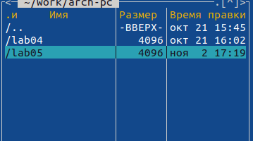{#fig:001 width=70%}

2. Пользуясь строкой ввода и командой touch создадим файл lab5-1.asm.(@fig:002)

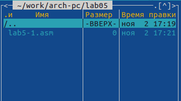{#fig:002 width=70%}

3. С помощью функциональной клавиши F4 откроем файл lab5-1.asm для редактирования во встроенном редакторе и напечатаем следующий текст программы (@fig:003)
```SECTION .data
msg: DB 'Введите строку:', 10
msgLen: EQU $-msg
SECTION .bss
buf1: RESB 80
SECTION .text
GLOBAL _start
_start:
mov eax,4
mov ebx,1
mov ecx,msg
mov edx,msgLen
int 80h
mov eax,3
mov ebx,0
mov ecx,buf1
mov edx,80
int 80h
mov eax,1
mov ebx,0
int 80h```


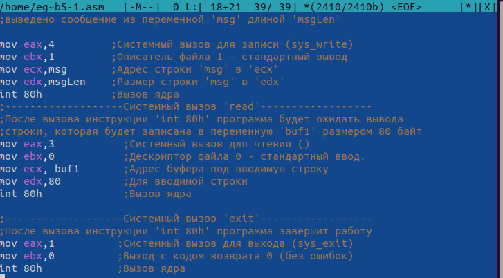{#fig:003 width=70%}

4. Оттранслируем текст программы lab5-1.asm в объектный файл. Выполним компо-
новку объектного файла и запустим получившийся исполняемый файл. Программа выводит строку 'Введите строку:' и ожидает ввода с клавиатуры. На запрос введем
ФИО.(@fig:004).

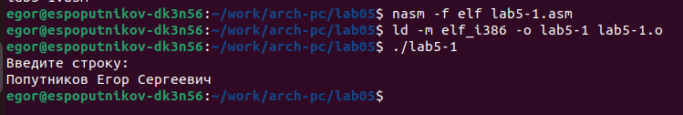{#fig:004 width=70%}

5. Скачаем файл in_out.asm со страницы курса в ТУИС. Подключаемый файл in_out.asm должен лежать в том же каталоге, что и файл с программой, в которой он используется. В одной из панелей mc откроем каталог с файлом lab5-1.asm. В другой панели каталог со скаченным файлом in_out.asm (для перемещения между панелями используем Tab ).
Скопируем файл in_out.asm в каталог с файлом lab5-1.asm с помощью функциональной
клавиши F5.С помощью функциональной клавиши F6 создадим копию файла lab5-1.asm с именем
lab5-2.asm.(@fig:006)

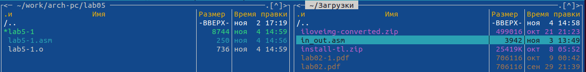{#fig:005 width=100%}

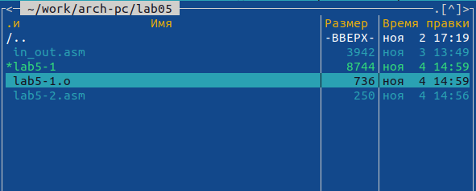{#fig:006 width=70%}

6. Исправим текст программы в файле lab5-2.asm с использованием подпрограмм из
внешнего файла in_out.asm (используем подпрограммы sprintLF, sread и quit)(@fig:007)
```%include 'in_out.asm'
SECTION .data
msg: DB 'Введите строку:',0h
SECTION .bss
buf1: RESB 80
SECTION .text
GLOBAL _start
_start:
mov eax,msg
call sprint
mov ecx, buf1
mov edx,80
call sread
call quit```


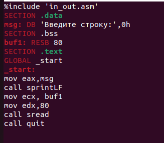{#fig:007 width=70%}

7. В файле lab5-2.asm заменим подпрограмму sprintLF на sprint. Создадим исполняе-
мый файл и проверим его работу.(Разница этих подпрограмм в том,что sprintLF добавляет к сообще-
нию символ перевода строки) (@fig:008)

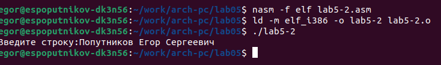{#fig:008 width=70%}

# Выполнение самостоятельной работы

Создадим копию файла lab5-1.asm. Внесём изменения в программу (без использова-
ния внешнего файла in_out.asm), так чтобы она работала по следующему алгоритму:
• вывести приглашение типа “Введите строку:”;
• ввести строку с клавиатуры;
• вывести введённую строку на экран.(@fig:009)
```SECTION .data
msg: DB 'Введите строку:',10
msgLen: EQU $-msg
inputPrompt: DB 'Введенная строка:',10
inputPromptLen: EQU $-inputPrompt
SECTION .bss
buf1: RESB 80
SECTION .text
GLOBAL _start

_start:
    ; Вывести приглашение "Введите строку:"
    mov eax, 4
    mov ebx, 1
    mov ecx, msg
    mov edx, msgLen
    int 80h

    ; Ввести строку с клавиатуры
    mov eax, 3
    mov ebx, 0
    mov ecx, buf1
    mov edx, 80
    int 80h

    ; Вывести введенную строку на экран
    mov eax, 4
    mov ebx, 1
    mov ecx, inputPrompt
    mov edx, inputPromptLen
    int 80h

    mov eax, 4
    mov ebx, 1
    mov ecx, buf1
    mov edx, 80
    int 80h

    ; Завершить программу
    mov eax, 1
    xor ebx, ebx
    int 80h```

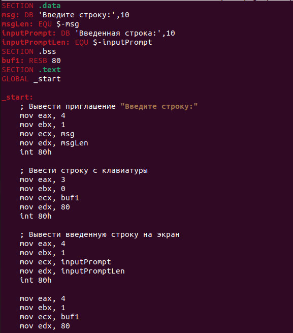{#fig:009 width=70%}

Получим исполняемый файл и проверим его работу. На приглашение ввести строку
введем ФИО.(@fig:010)

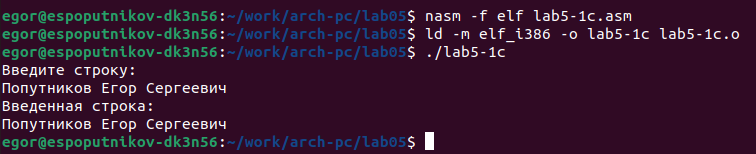{#fig:010 width=70%}

Создадим копию файла lab5-2.asm. Исправим текст программы с использованием под-
программ из внешнего файла in_out.asm, так чтобы она работала по следующему
алгоритму:
• вывести приглашение типа “Введите строку:”;
• ввести строку с клавиатуры;
• вывести введённую строку на экран.(@fig:011)
```%include 'in_out.asm'
SECTION .data
msg: DB 'Введите строку: ',0h
SECTION .bss
buf1: RESB 80
SECTION .text
GLOBAL _start
_start:
; Вывести приглашение "Введите строку:"
mov eax, msg
call sprintLF

; Ввести строку с клавиатуры
mov ecx, buf1
mov edx, 80
call sread

; Вывести введенную строку на экран
mov eax, buf1
call sprintLF

call quit```


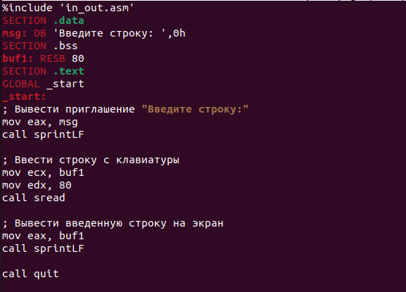{#fig:011 width=70%}

Создадим исполняемый файл и проверим его работу.(@fig:012)

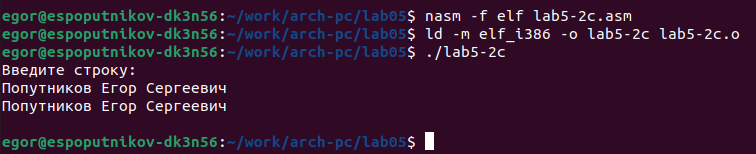{#fig:012 width=70%}

# Выводы

Я приобрёл практические навыки работы в Midnight Commander. Освоил инструкции
языка ассемблера mov и int.

