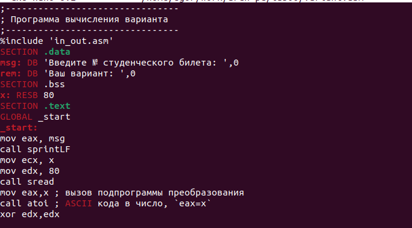

---
## Front matter
title: "Отчёт по лабораторной работе №6"
subtitle: "Арифметические операции в NASM."
author: "Попутников Егор Сергеевич"

## Generic otions
lang: ru-RU
toc-title: "Содержание"

## Bibliography
bibliography: bib/cite.bib
csl: pandoc/csl/gost-r-7-0-5-2008-numeric.csl

## Pdf output format
toc: true # Table of contents
toc-depth: 2
lof: true # List of figures
lot: true # List of tables
fontsize: 12pt
linestretch: 1.5
papersize: a4
documentclass: scrreprt
## I18n polyglossia
polyglossia-lang:
  name: russian
  options:
	- spelling=modern
	- babelshorthands=true
polyglossia-otherlangs:
  name: english
## I18n babel
babel-lang: russian
babel-otherlangs: english
## Fonts
mainfont: PT Serif
romanfont: PT Serif
sansfont: PT Sans
monofont: PT Mono
mainfontoptions: Ligatures=TeX
romanfontoptions: Ligatures=TeX
sansfontoptions: Ligatures=TeX,Scale=MatchLowercase
monofontoptions: Scale=MatchLowercase,Scale=0.9
## Biblatex
biblatex: true
biblio-style: "gost-numeric"
biblatexoptions:
  - parentracker=true
  - backend=biber
  - hyperref=auto
  - language=auto
  - autolang=other*
  - citestyle=gost-numeric
## Pandoc-crossref LaTeX customization
figureTitle: "Рис."
tableTitle: "Таблица"
listingTitle: "Листинг"
lofTitle: "Список иллюстраций"
lotTitle: "Список таблиц"
lolTitle: "Листинги"
## Misc options
indent: true
header-includes:
  - \usepackage{indentfirst}
  - \usepackage{float} # keep figures where there are in the text
  - \floatplacement{figure}{H} # keep figures where there are in the text
---

# Цель работы

Освоение арифметических инструкций языка ассемблера NASM.

# Задание

Написать программу вычисления выражения y=f(x). Программа должна выводить
выражение для вычисления, выводить запрос на ввод значения x, вычислять задан-
ное выражение в зависимости от введенного x, выводить результат вычислений. Вид
функции f(x) выбрать из таблицы 6.3 вариантов заданий в соответствии с номером
полученным при выполнении лабораторной работы. Создайте исполняемый файл и
проверьте его работу для значений x1 и x2 из 6.3.

# Выполнение лабораторной работы

1. Создадим каталог для программ лабораторной работы № 6, перейдем в него и
создадим файл lab6-1.asm:(@fig:001)

{#fig:001 width=70%}

2. Введём в файл lab6-1.asm текст программы из листинга 6.1.(@fig:002).

{#fig:002 width=70%}

3. Создадим исполняемый файл и запустим его.(@fig:004).

{#fig:003 width=70%}

{#fig:004 width=70%}

4. Далее изменим текст программы и вместо символов, запишем в регистры числа. Ис-
правим текст программы (Листинг 6.1) следующим образом: заменим строки:
mov eax,'6'
mov ebx,'4'
на строки
mov eax,6
mov ebx,4 (@fig:005).

{#fig:005 width=70%}

5. Создадим исполняемый файл и запустим его.(@fig:006).

{#fig:006 width=70%}

Как и в предыдущем случае при исполнении программы мы не получим число 10. В данном
случае выводится символ с кодом 10.Число 10 в таблице ASCII соответствует символу переноса строки,следовательно, на экран ничего не выводится.

6. Преобразуем текст программы из Листинга 6.1 с использованием функций из файла in_out.asm.Создадим файл lab6-2.asm исправим в нём текст из листинга и создадим исполняемый файл.(@fig:008)

{#fig:007 width=70%}

{#fig:008 width=70%}

7. Аналогично предыдущему примеру изменим символы на числа. Заменим строки:
mov eax,'6'
mov ebx,'4'
на строки
mov eax,6
mov ebx,4 
Создадим исполняемый файл и запустим его. (@fig:009)

{#fig:009 width=70%}

В результате выполнения программы был получен результат 10.

8. Заменим функцию iprintLF на iprint. Создадим исполняемый файл и запустим его.(@fig:011)

{#fig:010 width=70%}

{#fig:011 width=70%}

Функции отличаются тем, что iprintLF переводит написанный текст на следующую строку, а iprint нет.

9. Создадим файл lab6-3.asm в каталоге ~/work/arch-pc/lab06(@fig:012)

{#fig:012 width=70%}

10. Запишем текст из листинга 6.3, создадим исполняемый файл и запустим его.(@fig:014)

{#fig:013 width=70%}

{#fig:014 width=70%}

11. Изменим текст программы для вычисления выражения f(x) = (4 * 6 + 2)/5. Создадим
исполняемый файл и проверим его работу.(@fig:015)

{#fig:015 width=70%}

12. В качестве другого примера рассмотрим программу вычисления варианта задания по
номеру студенческого билета, работающую по следующему алгоритму:
• вывести запрос на введение № студенческого билета
• вычислить номер варианта по формуле: (Sn mod 20) + 1, где Sn – номер студен-
ческого билета (В данном случае a mod b – это остаток от деления a на b).
• вывести на экран номер варианта.
В данном случае число, над которым необходимо проводить арифметические операции,
вводится с клавиатуры. Как отмечалось выше ввод с клавиатуры осуществляется в символь-
ном виде и для корректной работы арифметических операций в NASM символы необхо-
димо преобразовать в числа. Для этого может быть использована функция atoi из файла
in_out.asm.
Создадим файл variant.asm в каталоге ~/work/arch-pc/lab06:

touch ~/work/arch-pc/lab06/variant.asm

Запишем в него текст из листинга 6.4: (@fig:016)

{#fig:016 width=70%}

Создадим исполняемый файл и проверим работу программы.(@fig:017)

{#fig:017 width=70%}

1. Какие строки листинга 6.4 отвечают за вывод на экран сообщения ‘Ваш вариант:’?
За вывод сообщения на экран отвечают строки:
rem: DB 'Ваш вариант: ',0
mov eax,rem
call sprint
2. Для чего используется следующие инструкции?
mov ecx, x
mov edx, 80
call sread 
Добавление в регистр ecx x, добавление в регистр edx 80, чтение с консоли
3. Для чего используется инструкция “call atoi”?
Преобразование символа в число
4. Какие строки листинга 6.4 отвечают за вычисления варианта?
xor edx,edx
mov ebx,20
div ebx
inc edx
5. В какой регистр записывается остаток от деления при выполнении инструкции “div
ebx”?
В регистр edx.
6. Для чего используется инструкция “inc edx”?
Прибавление 1 к регистру edx.
7. Какие строки листинга 6.4 отвечают за вывод на экран результата вычислений?
call iprintLF

# Выполнение самостоятельной работы
Напишем программу вычисления выражения y = 4/3*(x − 1)+5.Создадим исполняемый файл и
проверим его работу для значений x1 и x2(4,10)(@fig:020)

{#fig:018 width=70%}

{#fig:019 width=70%}

{#fig:020 width=70%}

# Выводы

Я освоил арифметические инструкции языка ассемблера NASM.
