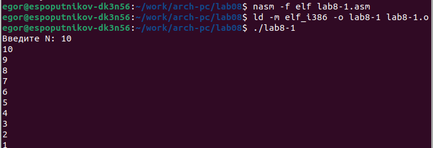
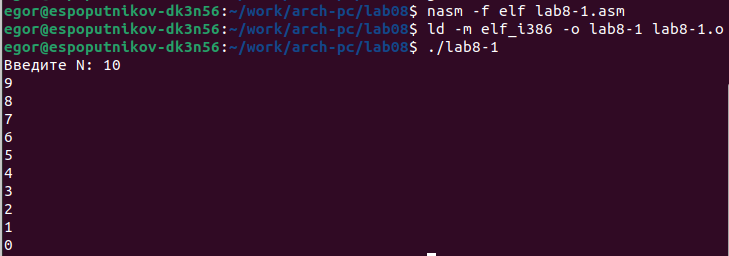
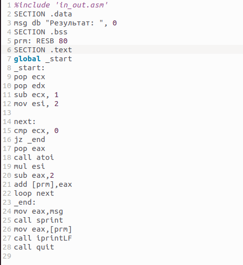

---
## Front matter
title: "Отчёт по лабораторной работе №8"
subtitle: "Программирование
цикла. Обработка аргументов командной строки."
author: "Попутников Егор Сергеевич"

## Generic otions
lang: ru-RU
toc-title: "Содержание"

## Bibliography
bibliography: bib/cite.bib
csl: pandoc/csl/gost-r-7-0-5-2008-numeric.csl

## Pdf output format
toc: true # Table of contents
toc-depth: 2
lof: true # List of figures
lot: true # List of tables
fontsize: 12pt
linestretch: 1.5
papersize: a4
documentclass: scrreprt
## I18n polyglossia
polyglossia-lang:
  name: russian
  options:
	- spelling=modern
	- babelshorthands=true
polyglossia-otherlangs:
  name: english
## I18n babel
babel-lang: russian
babel-otherlangs: english
## Fonts
mainfont: PT Serif
romanfont: PT Serif
sansfont: PT Sans
monofont: PT Mono
mainfontoptions: Ligatures=TeX
romanfontoptions: Ligatures=TeX
sansfontoptions: Ligatures=TeX,Scale=MatchLowercase
monofontoptions: Scale=MatchLowercase,Scale=0.9
## Biblatex
biblatex: true
biblio-style: "gost-numeric"
biblatexoptions:
  - parentracker=true
  - backend=biber
  - hyperref=auto
  - language=auto
  - autolang=other*
  - citestyle=gost-numeric
## Pandoc-crossref LaTeX customization
figureTitle: "Рис."
tableTitle: "Таблица"
listingTitle: "Листинг"
lofTitle: "Список иллюстраций"
lotTitle: "Список таблиц"
lolTitle: "Листинги"
## Misc options
indent: true
header-includes:
  - \usepackage{indentfirst}
  - \usepackage{float} # keep figures where there are in the text
  - \floatplacement{figure}{H} # keep figures where there are in the text
---

# Цель работы

Приобретение навыков написания программ с использованием циклов и обработкой
аргументов командной строки.

# Задание

1. Напишите программу, которая находит сумму значений функции f(x) для
x = x1, x2, ..., xn, т.е. программа должна выводить значение f(x1) + f(x2) + ... + f(xn).
Значения xi передаются как аргументы. Вид функции f(x) выбрать из таблицы
8.1 вариантов заданий в соответствии с вариантом, полученным при выполнении
лабораторной работы № 7. Создайте исполняемый файл и проверьте его работу на
нескольких наборах x = x1, x2, ..., xn.

# Выполнение лабораторной работы

Создадим каталог для программ лабораторной работы № 8, перейдем в него и создадим
файл lab8-1.asm:(@fig:001)

{#fig:001 width=70%}

Введем в файл lab8-1.asm текст программы из листинга 8.1. Создадим исполняемый файл
и проверим его работу.(@fig:002)

{#fig:002 width=70%}

Данный пример показывает, что использование регистра ecx в теле цилка loop может
привести к некорректной работе программы. Изменим текст программы добавив изменение
значение регистра ecx в цикле:(@fig:003)

{#fig:003 width=70%}

Регистр ecx принимает нечётные значения,число проходов цикла не соответствует значению N.

Для использования регистра ecx в цикле и сохранения корректности работы программы
можно использовать стек. Внесем изменения в текст программы добавив команды push
и pop (добавления в стек и извлечения из стека) для сохранения значения счетчика цикла
loop:(@fig:004)

{#fig:004 width=70%}

В данном случае число проходов цикла соответствует значению N.

При разработке программ иногда встает необходимость указывать аргументы, которые
будут использоваться в программе, непосредственно из командной строки при запуске
программы.
При запуске программы в NASM аргументы командной строки загружаются в стек в обрат-
ном порядке, кроме того в стек записывается имя программы и общее количество аргументов.
Последние два элемента стека для программы, скомпилированной NASM, – это всегда имя
программы и количество переданных аргументов.
Таким образом, для того чтобы использовать аргументы в программе, их просто нужно
извлечь из стека. Обработку аргументов нужно проводить в цикле. Т.е. сначала нужно из-
влечь из стека количество аргументов, а затем циклично для каждого аргумента выполнить
логику программы.Создадим файл lab8-2.asm в каталоге ~/work/arch-pc/lab08 и введем в него текст программы из листинга 8.2.
Создадим исполняемый файл и запустим его, указав аргументы:(@fig:006)

{#fig:005 width=70%}

{#fig:006 width=70%}

Программой было обработано 4 аргумента.

Создадим файл lab8-3.asm в каталоге ~/work/arch-
pc/lab08 и введем в него текст программы, которая выводит сумму чисел, которые пере-
даются в программу как аргументы.(@fig:007)

{#fig:007 width=70%}

Изменим текст программы из листинга 8.3 для вычисления произведения аргументов
командной строки.(@fig:008)

{#fig:008 width=70%}

# Выполнение самостоятельной работы

1. Напишите программу, которая находит сумму значений функции f(x) для
x = x1, x2, ..., xn, т.е. программа должна выводить значение f(x1) + f(x2) + ... + f(xn).
Значения xi передаются как аргументы. Вид функции f(x) выбрать из таблицы
8.1 вариантов заданий в соответствии с вариантом, полученным при выполнении
лабораторной работы № 7. Создайте исполняемый файл и проверьте его работу на
нескольких наборах x = x1, x2, ..., xn.Вариант №4.(@fig:010)

{#fig:009 width=70%}

{#fig:010 width=70%}

# Выводы

Я приобрел навыки написания программ с использованием циклов и обработкой
аргументов командной строки.

